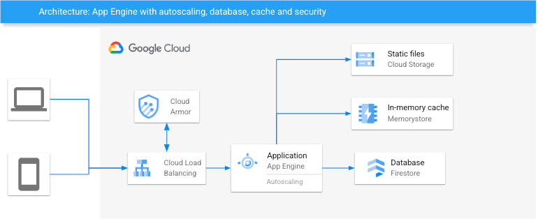

# Phonebook on App Engine

## Introduction
This application shows how to deploy an application to App Engine and integrate with other products such as Firestore, Redis and Cloud Armor.



## Deploy

### Infrastructure
1. Create a new project and select it

2. Open Cloud Shell and ensure the var is set. Otherwise set it with `gcloud config set project` command
```
echo $GOOGLE_CLOUD_PROJECT
```

3. Create a bucket to store your project's Terraform state
```
gsutil mb gs://$GOOGLE_CLOUD_PROJECT-tf-state
```

4. Enable the necessary APIs
```
gcloud services enable cloudbuild.googleapis.com redis.googleapis.com vpcaccess.googleapis.com compute.googleapis.com firestore.googleapis.com cloudresourcemanager.googleapis.com appengine.googleapis.com servicenetworking.googleapis.com
```

5. Go to [IAM](https://console.cloud.google.com/iam-admin/iam), then add `Editor` and `Service Networking Admin` roles to the Cloud Build's service account `<PROJECT_NUMBER>@cloudbuild.gserviceaccount.com`.

6. Clone this repo into the Cloud Shell, then go to the dir.
```
git clone https://github.com/sylvioneto/phonebook-appengine.git
cd ./phonebook-appengine
```

7. Execute Terraform using Cloud Build
```
gcloud builds submit ./terraform --config cloudbuild_infra.yaml
```


### Application 

1. Create an app
```
gcloud app create --region=southamerica-east1
```

2. Go to [Create a Cloud Firestore](https://console.cloud.google.com/firestore/) and make sure your database is in `Native` mode and located in `southamerica-east1`.

3. Go to [IAM](https://console.cloud.google.com/iam-admin/iam), then add `Cloud Datastore User` role to `<PROJECT_ID>@appspot.gserviceaccount.com` service account.

4. Open the `app.yaml` file and replace `<REDIS_IP>` by the [Redis's IP](https://console.cloud.google.com/memorystore/redis/instances) and `<PROJECT_ID>` by your project's ID.

5. Deploy the app using Cloud Build
```
gcloud builds submit ./app --config cloudbuild_app.yaml
```

6. Access your app using the load balancer's IP. This is for testing purposes, for actual applications it is recommended to use DNS and HTTPS.  
You can get the LB IP by running the command below or [clicking here](https://console.cloud.google.com/net-services/loadbalancing/details/http/appengine-lb-url-map):
```
gcloud compute addresses describe appengine-lb-address --global
```

## Destroy
Execute Terraform using Cloud Build
```
gcloud builds submit ./terraform --config cloudbuild_destroy.yaml
```

## Debugging
You can run it locally:
```
cd ./app
python3 -m venv venv
source venv/bin/activate
pip install -r requirements.txt
export FLASK_ENV=development export FLASK_APP=main.py
python -m flask run
```
gcloud app browse

Testing
export FLASK_ENV=development; export FLASK_APP=main.py; python -m flask run
